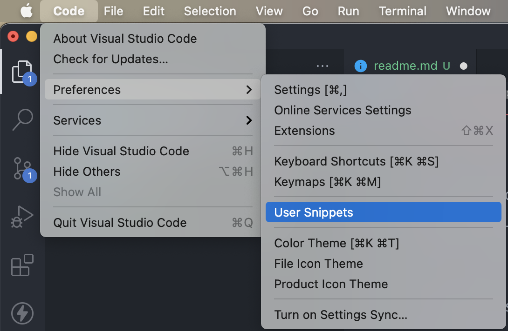
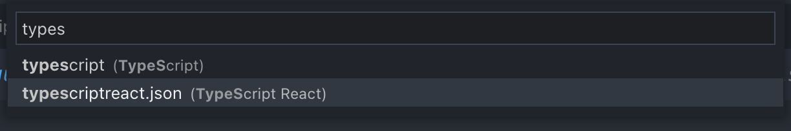

# Helpful VSCode Snippets

This repository contains a bunch of helpful VSCode Snippets for my day-to-day dev work.
Will fill this out over time.

To add snippets to VSCode, do the following:

1. Navigate to `User Snippets` under `Preferences`:

2. Open the file for whichever language you want to add the snippet for: (example: `typescriptreact`)

3. Fill out the file you opened with content from the related file in the `snippets/` folder in this repository. (example: `typescriptreact`)
